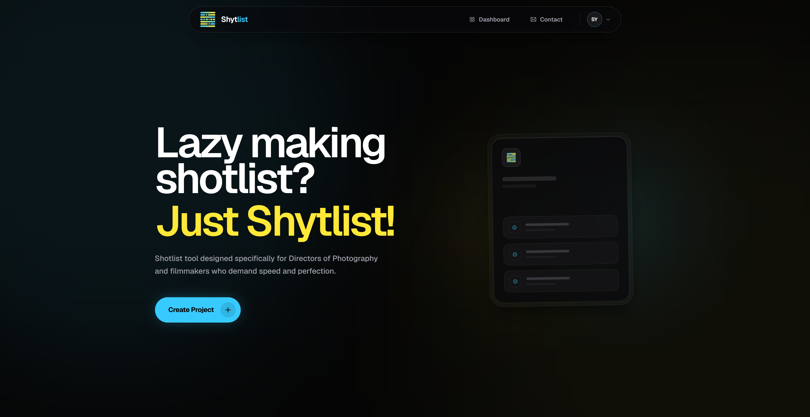
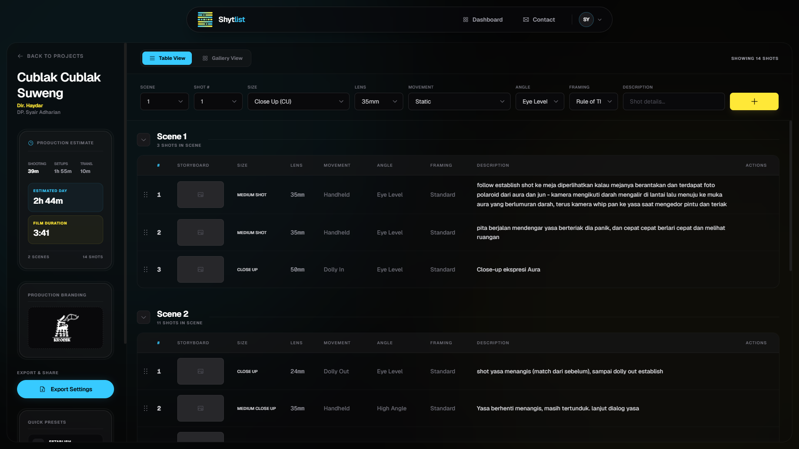

<div align="center">
  
  <h1>Shytlist</h1>
  <p><strong>Lazy making shotlists? Just Shytlist!</strong></p>
  <p>A high-performance, cinematic shotlist builder for DPs and Indie Filmmakers.</p>

  <p>
    <a href="https://github.com/SZQIEL/Shytlist/blob/main/LICENSE">
      
    </a>
    
    
    
    
    
  </p>
</div>

---

## 📽️ The Kinetic Viewfinder

Shytlist is not just another spreadsheet. It’s a sophisticated pro-tool designed to feel like an extension of your camera hardware. Built for agile commercial workflows and indie sets, it provides a high-contrast, visual-first workspace that eliminates pre-production friction.

<p align="center">
  
</p>

## ✨ Crafted for the Set

Ditch the infinite-grid nightmare of legacy software. Shytlist is built around speed, aesthetics, and precise production metrics.

### 1. The Command Center (Dashboard)
Manage your film projects with a clean, cinematic interface. Instantly view your total scenes, shot counts, and access your production branding. 

<p align="center">
  
</p>

### 2. Frictionless Shotlist Editor
Drag, drop, and reorder shots with smooth spring-physics animations. Toggle seamlessly between a precise **Table View** and a visual **Gallery Storyboard**.

<p align="center">
  
</p>

## 🎬 Core Features

- **⚡ Effortless Scene Management** – Automatic shot numbering and re-calculation as you move shots between scenes. No more manual spreadsheet math.
- **⏱️ Production Intelligence** – Real-time estimated runtimes based on your shot setups and transition metrics. Know your schedule before you hit record.
- **👁️ On-Set Accessibility** – True dark-mode (`#000000`) and high-contrast neon accents designed specifically to prevent eye strain during night shoots and maintain legibility under harsh sunlight.
- **📄 Pro Exports** – Generate branded, landscape PDF shotlists ready to hand out to your crew.
- **🔒 Secure Collaboration** – Private project protection backed by Supabase.

## 🛤️ Future Updates

- [ ] **Multi-user Collaboration** – Real-time co-editing for DP/Director teams.
- [ ] **Advanced Cinematic AI** – Auto-suggest shots based on script snippets.
- [ ] **Lighting Diagrams** – Integrated 2D overhead lighting planner.

---

## 🛠️ Tech Stack & Architecture

While the UI is built for artists, the engine is built for scale.

- **Frontend:** React 19 (TS), Vite 6, Tailwind CSS 4
- **Animation:** Motion (Spring Physics) for a tactile, hardware-like feel.
- **Database & Auth:** Supabase (Postgres, Storage)
- **Deployment:** Vercel

## 🚀 Local Development

Follow these steps to get Shytlist running on your machine:

1. **Clone the repository**
   ```bash
   git clone https://github.com/SZQIEL/Shytlist.git
   cd Shytlist
   ```

2. **Install Dependencies**
   ```bash
   npm install
   ```

3. **Configure Environment Variables**
   Create a `.env.local` file in the root directory and add your Supabase credentials:
   ```env
   VITE_SUPABASE_URL=your_supabase_url
   VITE_SUPABASE_ANON_KEY=your_supabase_anon_key
   ```

4. **Launch the Development Server**
   ```bash
   npm run dev
   ```

## 📜 License

Distributed under the MIT License. See `LICENSE` for more information.

---

<div align="center">
  <p>Built for the next generation of filmmakers by <a href="https://github.com/SZQIEL">szqiel/p>
</div>